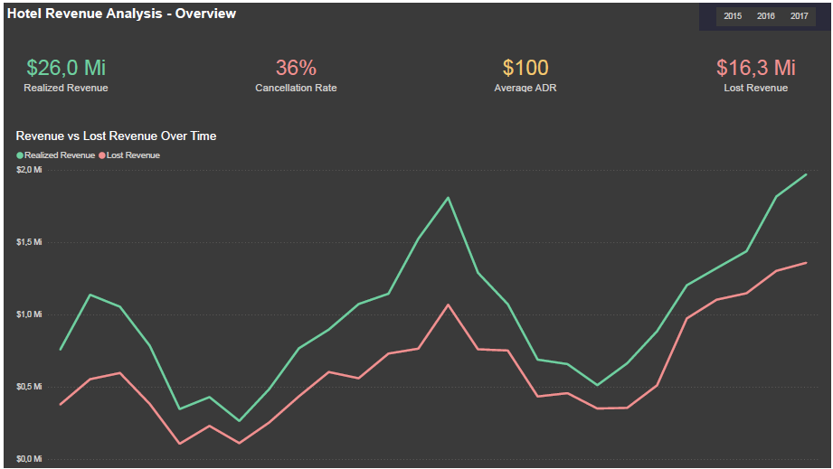
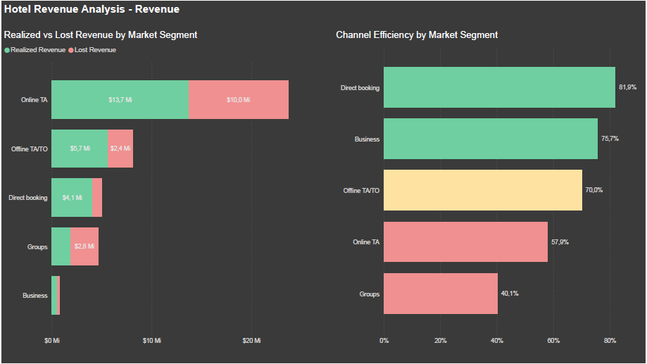
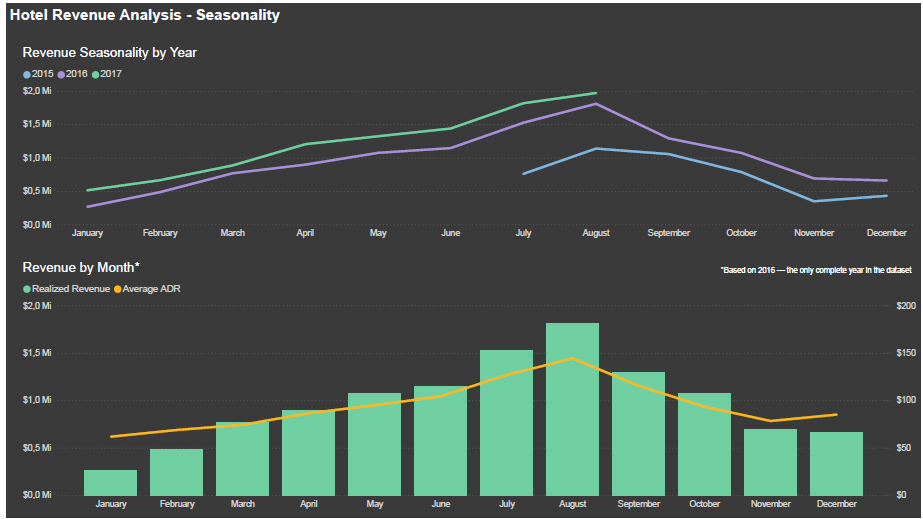
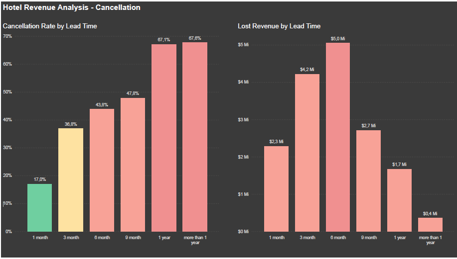
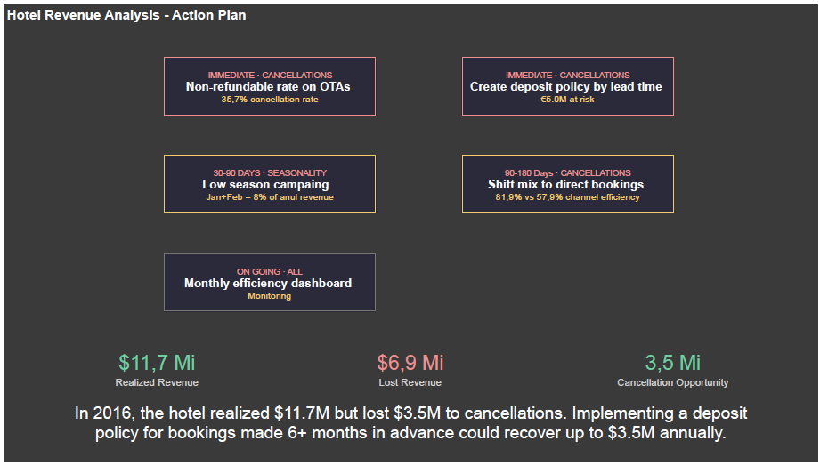

# 🏨 Hotel Revenue Analysis

**Python · Power BI · 119,389 reservations · 2015–2017**

The hotel was growing. Revenue up, ADR up. But when I calculated what it *could* have made versus what actually landed in the books, the gap was hard to ignore. That gap became the whole project.

-----

## 🗂️ The data

Three CSV files from Kaggle, one per year, merged and cleaned in Python before anything else. 
Before cleaning: 119,390 rows and 32 columns. 
After cleaning: 119,389 rows and 31 columns. 
One row removed due to a negative ADR value. 
The company column was dropped. With 94.31% missing values, it was unusable for analysis.
Only 2016 is a complete year. 2015 starts in July and 2017 ends in August. That matters and I’ll explain how I handled it where it’s relevant.

-----

## 🐍 What Python did before Power BI

The script merged the three files, removed bad values and treated nulls. From there, dates were broken into more useful dimensions, categorical fields got readable labels and new classification columns were built to support the analysis. The file was also prepared with future analysis in mind. 
Not everything built here appears in this version, but it will be ready when the next question comes up. The result went into Power BI as a clean file ready to answer business questions.

-----

## 📊 The dashboard

<!---->

I kept the dashboard intentionally lean. Five pages, each answering one question. No chart for the sake of having a chart. The goal was that someone with two minutes could understand what was happening and what to do about it, without needing to interpret anything.

-----

## 🔍 Page 1 · Overview


The starting point. Two lines on a chart that tell the whole story before you read a single number. One going up, one following it. The year filter makes it interactive and the pattern holds no matter which year you pick.

-----

## 💰 Page 2 · Revenue Drivers



Volume looked fine. Efficiency told a different story. This page is about not how many bookings each channel brings, but how much of their potential revenue actually arrives. The gap between the two is where the problem lives.

-----

## 📅 Page 3 · Seasonality



The monthly chart uses 2016 only. Since 2015 and 2017 are partial years, combining all three would distort the seasonal curve, inflating months that appear in all years and deflating those that don’t. The note lives on the chart itself. The multi-year line chart alongside it shows the same pattern repeating, which confirms it’s structural and not a one-off.

-----

## ❌ Page 4 · Cancellations



The color coding on the lead time chart is deliberate. It’s not just showing rates. It’s showing where the actual revenue destruction is concentrated, which turns out to be a different place than where the cancellation rate is highest. That’s the finding worth paying attention to on this page.

-----

## 🎯 Page 5 · Action Plan



The numbers here come from 2016 only. It’s the only complete year in the dataset so it’s the only reliable basis for estimates that need to hold up year over year. Five actions, ordered by how quickly they can move. The recovery potential at the bottom of the page comes directly from the analysis, no assumptions added.

-----

## 💡 Decisions worth knowing about

**The duplicate rows**

Before removing them I checked where they were concentrated and 88.55% were from TA/TO channel (Travel Agency / Tour Operator), which operates with group bookings, multiple rooms booked under the same contract with identical attributes. So they stayed in for volume analyses and were only removed when studying individual guest behavior.

**The scope**

This version focuses on cancellations, channel efficiency and seasonality. Other dimensions were explored and left out on purpose. A dashboard that answers three questions clearly is more useful than one that shows everything and answers nothing.

**Countries**

The dataset contains bookings from dozens of countries. Rather than mapping all of them, I covered the 15 most frequent, which account for 91% of reservations. Everything else was grouped under Others.

**Revenue**

There’s no revenue column in the source. I calculated it as ADR multiplied by total nights. Check-outs count as realized. Cancellations count as potential lost. That’s the gap the whole project is built around.

-----

## 🛠️ Tools and measures

|                |                                      |
|----------------|--------------------------------------|
|Kaggle          |Source data                           |
|Python · pandas |Merging, cleaning, feature engineering|
|Power Query     |Final transformations in Power BI     |
|DAX             |Custom business measures              |
|Power BI Desktop|Dashboard                             |
|GitHub          |Version control and portfolio         |

```dax
Realized Revenue =
CALCULATE(
    SUMX(base, base[ADR] * base[Total_Nights]),
    base[Reservation_Status] = "Check-Out")

Lost Revenue =
CALCULATE(
    SUMX(base, base[ADR] * base[Total_Nights]),
    base[Reservation_Status] = "Canceled")

Cancellation Rate =
DIVIDE(
    COUNTROWS(FILTER(base, base[Reservation_Status] = "Canceled")),
    COUNTROWS(base), 0)

Channel Efficiency =
DIVIDE([Realized Revenue], [Realized Revenue] + [Lost Revenue], 0)

Cancellation Opportunity = [Lost Revenue] * 0.5
```

-----

## 🚀 Want to go deeper?

This is the macro view. There’s a more detailed analysis waiting: room type mix, hotel-level differences across seasons, guest profile by channel. If that’s interesting to you, I’d be glad to walk through it.
